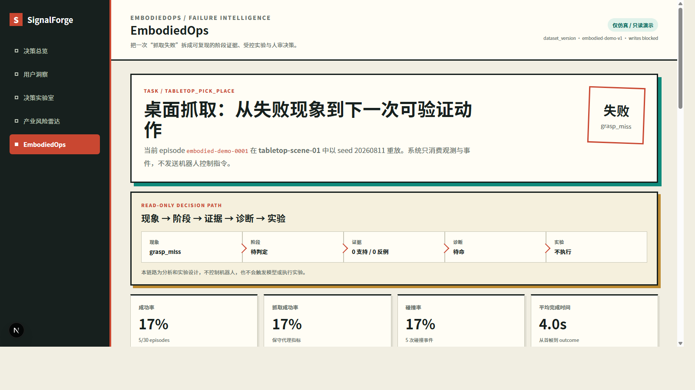
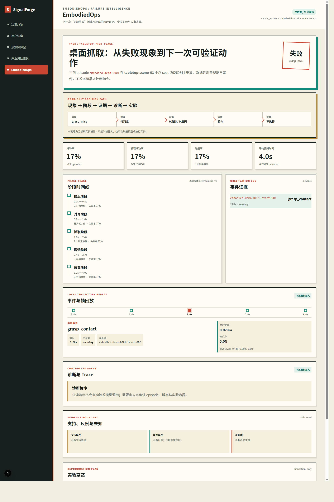
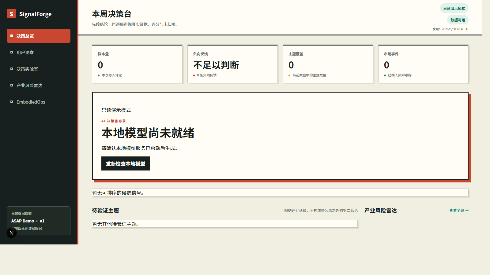
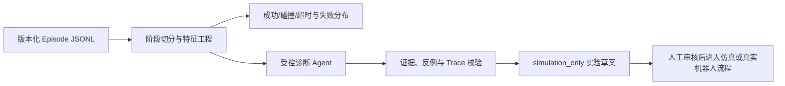

# EmbodiedOps / SignalForge

EmbodiedOps 是 SignalForge 中面向具身智能团队的本地、只读故障诊断工作台。它把一次桌面抓取任务拆成可追溯的 episode、阶段、事件证据、受控诊断与仿真实验草案，帮助机器人产品、算法和测试团队把“任务失败”转化为可复现的排查与验证问题。

这是一份面试作品与工程原型，不是机器人控制系统：页面不发送控制命令，不接入真实机器人的执行链路，也不声称持有 Unitree、优必选、傅利叶或其他公司的内部数据。

> **运行成本：免费** — 全本地运行，不调用付费 API / 云模型 / 商业数据；Ollama 为可选本地模型。

## 界面预览



*只读演示：episode 回放、只读决策链路与失败分布指标（dataset `embodied-demo-v1`，写入被阻断）。*





## 产品解决什么问题

对于一次 pick-and-place 失败，单纯记录成功/失败无法回答：失败发生在哪个阶段、支持该判断的事件是什么、证据是否有反例、下一步该验证什么。EmbodiedOps 将这条链路标准化为：



- **对象**：6-DoF 机械臂与两指夹爪的桌面抓取任务。
- **阶段**：`approach → align → grasp → transfer → place`。
- **失败类型**：抓取未保持、遮挡、碰撞、规划不可达、超时、末端执行器未对齐、夹爪力不足。
- **AI 的角色**：仅在允许的 episode 摘要和事件 ID 范围内归纳候选机制；规则层验证事件、时间窗、数值主张与反例。
- **安全边界**：未知事件、越界时间、捏造数值、反例缺失都会 fail-closed；输出为 `needs_evidence` 或拒绝状态，而非编造结论。

## 快速启动（Docker，推荐）

前提：Docker Desktop 已启动。以下命令会构建本地前后端；不会调用云模型或付费 API。

```powershell
Set-Location D:\yuanjing\agent\project1

$env:DEMO_READ_ONLY = "true"
$env:NEXT_PUBLIC_DEMO_READ_ONLY = "true"
$env:NEXT_PUBLIC_API_BASE_URL = ""
$env:SIGNALFORGE_API_ORIGIN = "http://api:8000"

docker compose up --build -d
powershell -ExecutionPolicy Bypass -File scripts/verify_local.ps1
```

打开：

- 具身智能工作台：[http://localhost:3000/embodied](http://localhost:3000/embodied)
- 原 SignalForge 决策工作台：[http://localhost:3000](http://localhost:3000)
- 健康检查：[http://localhost:8000/healthz](http://localhost:8000/healthz)

只读启动会校验 `data/embodied/demo_episode_manifest.json` 中的 SHA-256，并幂等导入 `data/embodied/demo_episodes.jsonl` 的 `embodied-demo-v1`。fixture 缺失、hash 不匹配或版本冲突时会失败关闭，不会以空指标运行。

若 `3000` 已被其他本机项目占用，可以改用 `3001`，不需要停止那个未知容器：

```powershell
$env:WEB_HOST_PORT = "3001"
docker compose up --build -d web
```

此时本项目页面为 `http://localhost:3001/embodied`。临时外网演示必须先停止旧隧道，再明确指定新端口：

```powershell
powershell -ExecutionPolicy Bypass -File scripts/stop_demo_tunnel.ps1
powershell -ExecutionPolicy Bypass -File scripts/start_demo_tunnel.ps1 -WebBaseUrl http://localhost:3001
```

停止本地容器：

```powershell
docker compose down
```

## 本地开发与验证

前提：Python 3.11、Node.js 20+，并已准备项目根目录的 `.venv`。

```powershell
& .\.venv\Scripts\python.exe -m pytest backend\tests -q
& .\.venv\Scripts\python.exe -m ruff check backend

Set-Location frontend
npm ci
npm test -- --run
npm run lint
npm run build
```

离线回归工件：

- `eval/embodied_gold_cases.jsonl`：固定诊断评测样例。
- `eval/embodied_results.json`：诊断评测输出。
- `eval/embodied_business_cases.jsonl`：明确标注为合成的业务指标样例。
- `docs/EMBODIEDOPS_EVAL_REPORT.md`：当前离线评测及限制。
- `docs/EMBODIEDOPS_BUSINESS_EVAL.md`：业务指标和 sim-to-real 的拒答条件。

## 数据、模型与评测边界

当前公开演示数据是 30 条合成 tabletop pick-and-place episode，固定标注：

```text
dataset_version=embodied-demo-v1
real_robot_data=false
live_model=false
manual_review_status=not_performed
```

本仓库没有公开真实机器人轨迹、生产日志、客户数据或带有公司归属的数据。`docs/EMBODIEDOPS_REAL_DATA_CARD.md` 描述未来接入经过许可和脱敏的真实机器人导出时所需的来源、固件、任务族、授权、红线处理、holdout 与审核要求；该契约当前未被真实数据填充。

本地 Ollama 可选用于受控诊断适配，但公开离线结果不等同于实时模型质量证明。诊断规则、模型质量、人工接受率与业务结果分开报告；合成 before/after 样例**不构成生产 ROI 结论**，更不代表 sim-to-real 成功率提升。

## 演示与公开安全

演示必须同时设置 `DEMO_READ_ONLY=true` 和 `NEXT_PUBLIC_DEMO_READ_ONLY=true`：后端拒绝写接口，前端不展示诊断生成、重试或实验执行入口。网页仅用于观测、回放、证据浏览与既有快照展示，**不控制机器人**。

如确有临时远程演示需求，可在本地服务正常后运行：

```powershell
powershell -ExecutionPolicy Bypass -File scripts/start_demo_tunnel.ps1
```

该脚本使用 **Cloudflare Quick Tunnel** 临时暴露前端同源页面；它不提供 SLA，不暴露数据库、本地 Ollama 或 `11434` 端口。隧道地址会变更，不能写入 README、简历或 GitHub；演示结束后运行 `scripts/stop_demo_tunnel.ps1`。公开前请再次运行 `backend/tests/test_public_artifact_safety.py`，它检查真实密钥、数据库文件、临时隧道链接与原始模型输入/输出泄漏。

## 仓库导览

| 路径 | 内容 |
| --- | --- |
| `frontend/src/app/embodied` | 只读回放、阶段时间线、证据链与指标界面 |
| `backend/signalforge/embodied` | episode 契约、阶段/指标、受控诊断、实验与评测逻辑 |
| `backend/signalforge/api/routers/embodied.py` | 版本化 episode 与只读演示 API |
| `data/embodied` | 合成 fixture 及其不可变 manifest |
| `eval` | 可重复的离线评测输入与输出 |
| `docs/CASE_STUDY.md` | 产品问题、方法、指标、业务假设和上线门禁 |
| `docs/EMBODIEDOPS_PRD.md` | 产品需求文档：定位、核心流程、AI 边界与评测方案 |
| `docs/PROJECT_PLAN.md` | 项目时间线、风险与决策记录 |
| `docs/INTERVIEW_STORY.md` | 90 秒、5 分钟与深挖面试叙事 |

## 许可证

本仓库以 [MIT License](LICENSE) 发布。许可证不授予任何第三方机器人、数据集或品牌数据的使用权；使用者仍应遵守自己的数据授权、隐私、安全与机器人运行流程。
