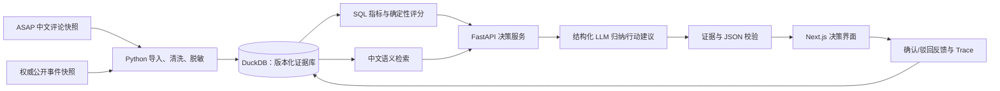

# SignalForge｜AI 决策情报台：设计规格

**状态：** 已完成设计，待用户审阅  
**目标周期：** 2 周（首个可公开展示的 MVP）  
**目标岗位：** AI 产品经理、项目经理、数据分析师  
**设计原则：** 国内业务语境优先；每项 AI 结论必须可追溯；用可验证深度代替功能堆砌。

## 1. 问题与产品定位

业务团队面对大量用户反馈与产业外部信息时，通常需要手工归纳痛点、判定优先级、制定行动、同步风险。传统 BI 能计算结构化指标，但难以理解中文非结构化评论；通用聊天机器人则经常给出没有证据、不可复核的建议。

SignalForge 是面向互联网产品团队的**AI 决策情报台**。它将用户评论与权威外部事件转化为一条可检查的链路：

> 信号 → 证据 → 洞察 → 透明评分 → 行动/实验 → 人工反馈与复盘

首版的主场景是中文用户评论的产品机会识别；产业风险雷达是面向半导体、制造业和企业服务岗位的轻量迁移场景。它们共用数据治理、证据检索、评分、行动卡和审计能力，不是两个独立产品。

### 1.1 目标用户

1. **产品经理：** 需要从用户反馈中找出高价值问题，并把结论转成可验证的功能假设与实验。
2. **项目经理/业务负责人：** 需要把外部风险转成责任人、截止日期和缓解动作。
3. **数据分析师：** 需要验证指标口径、复现 SQL、检查样本与追踪结论质量。

### 1.2 成功标准

- 演示者能在 5 分钟内完成一条“信号到行动”的闭环，并打开每个结论的原始中文证据和评分组成。
- 从页面得到的所有数值均能追溯到版本化 DuckDB 数据集与查询逻辑。
- AI 在证据不足时明确拒绝下结论；不能生成无法验证的引用。
- 仓库有可复现安装、数据说明、评估报告、失败样例、产品文档和 3 分钟演示材料。

### 1.3 非目标

- 不做登录、组织权限、多租户、支付或通知系统。
- 不做泛化网络爬虫，不绕过登录、反爬或站点规则。
- 不做自主执行的多 Agent 或自动发布/发送动作。
- 不宣称真实商业收益、预测准确率或“实时”能力；未测量的结果必须标注为假设或目标。

## 2. 数据、合规与可复现性

### 2.1 数据范围

| 数据域 | 首版来源 | 用途 | 保存方式 |
|---|---|---|---|
| 用户反馈（主） | 美团点评 ASAP 数据集 | 中文评论、星级、18 个方面类别与情绪标签；用于主题、痛点与机会分析 | 只保留许可允许的原始/处理后数据；否则提供下载脚本和小型可分发样本 |
| 市场事件（辅） | 工信部公开政策/产业动态、上交所公开公告 | 政策、供应、竞争、合规事件的风险卡 | 人工精选 10–20 条；保存来源 URL、发布日期、摘录、采集日期 |
| 海外扩展（非核心） | Steam 官方公开评论接口或许可数据集 | 多语言连接器与可扩展性验证，不进入默认 Demo | 默认关闭；独立数据卡与数据版本 |

ASAP 是一个带 1–5 星评分、18 个方面情绪标签的中文真实评论数据集，含 46,730 条点评 App 评论，仓库为 Apache-2.0 许可。数据卡必须注明原始来源、论文引用、许可证、字段和处理过程，而不能将样本误称为项目自采数据。

### 2.2 数据边界

- MVP 使用**版本化快照**，不承诺实时刷新。每次导入生成 `dataset_version`、采集日期、行数、文件哈希与来源记录。
- 对政策/公告只保存必要摘录及链接；不把受版权或条款限制的全文无授权再分发。
- 不收集账号、联系方式、地理位置或其他可识别个人信息。展示前执行脱敏/敏感文本标记。
- 任何后续连接器都必须在其站点条款、robots.txt 与访问频率允许的范围内运行；失败时保留上一个有效快照并提示数据过期。

## 3. 用户体验与页面范围

### 3.1 决策总览

默认进入“本周决策桌面”：

- 三张最高优先级机会卡，展示问题名称、评分、推荐动作、证据数和状态；
- 两张最高风险事件卡，展示来源、风险等级、影响对象和下一检查点；
- 指标区显示样本量、负向反馈占比、已确认行动数和数据快照时间；
- 任何总览卡点击后都能进入对应的证据和评分明细。

### 3.2 用户洞察工作台

用户可按方面类别、星级、情绪和主题筛选评论，查看主题分布及代表性原文。AI 摘要只能基于当前筛选和检索返回的证据；每条摘要提供证据抽屉，列出评论 ID、原文、标签和检索相关度。

### 3.3 决策实验室

将确认后的洞察转为行动卡：问题陈述、目标用户、评分拆解、功能假设、实验设计、成功/护栏指标、负责人、截止时间和人工状态。用户可以确认、驳回或修改 AI 建议；这些反馈保存为后续评估数据，不静默覆盖初始结论。

### 3.4 产业风险雷达

以时间线和风险列表显示人工筛选的权威外部事件。每个事件都有来源、发布日期、事件类型、受影响领域、风险评分、缓解动作、负责人和状态。默认案例是“半导体供应/政策风险”，但数据模型不限定某一行业。

### 3.5 质量与审计抽屉

所有 AI 生成卡片都可打开审计抽屉，查看：输入数据版本、检索的证据 ID、Prompt 版本、模型标识、耗时、估算 token/成本、结构化输出校验结果和人工反馈。这是产品能力，不隐藏在开发者日志中。

## 4. 数据流与系统架构



### 4.1 技术边界

| 层 | 选择 | 责任 |
|---|---|---|
| Web | Next.js + TypeScript | 四个工作台、筛选状态、图表、证据/审计抽屉 |
| API | FastAPI + Pydantic | 数据与分析 API、鉴权以外的输入校验、响应契约 |
| 分析数据库 | DuckDB | 分析查询、版本化表、可复现 SQL、轻量本地部署 |
| ETL | Python | 导入、标准化、脱敏、质量检查、数据清单生成 |
| 语义能力 | 可替换的中文嵌入模型 | 只在版本化证据库内检索，不把检索结果当成事实本身 |
| LLM 适配器 | OpenAI-compatible 配置接口 | 结构化归纳与建议；可替换云端或本地模型 |
| Trace | 项目内轻量记录 | 记录 AI 输入输出质量；借鉴 Langfuse 的可观测性模式，不部署完整平台 |

不复制任何参考项目的完整界面或业务逻辑。Data Formulator 仅启发“自然语言与可控 UI 混合探索”的交互；Open Deep Research 仅启发“研究结论附来源与配置化”的流程；Langfuse 仅启发 Trace、评估和 Prompt 版本记录。

### 4.2 核心实体

- `dataset_versions`：版本、来源、导入时间、哈希、行数与许可证。
- `reviews`：评论 ID、版本、正文、星级、方面标签、情绪、脱敏标记。
- `market_events`：事件 ID、来源 URL、发布日期、摘录、类型、行业标签与证据质量。
- `insights`：主题、筛选范围、指标、证据 ID 列表、生成方式、状态。
- `decision_cards`：优先级分数及分项、假设、实验、负责人、截止时间、状态。
- `feedback`：对象 ID、确认/驳回/编辑、理由、时间。
- `traces`：模型、Prompt 版本、输入版本、证据列表、耗时、token/成本估算、校验结果。

## 5. 决策逻辑与 AI 约束

### 5.1 机会优先级

机会卡采用可解释的 0–100 分，并显示每项贡献：

`机会分 = 0.30 × 受影响度 + 0.25 × 负向强度 + 0.20 × 严重度 + 0.15 × 业务相关度 + 0.10 × 证据覆盖度`

- **受影响度：** 该主题评论占当前筛选样本的归一化比例；
- **负向强度：** 主题中负向标签的比例；
- **严重度：** 以星级、明确的失败/阻断语义和人工复核标签组成；
- **业务相关度：** 演示用户可以配置的业务目标权重，不伪装成模型预测；
- **证据覆盖度：** 可支持该洞察且相互独立的有效评论数量与一致性。

缺少某项时不以零静默替代，而是标记“不可评分”并从排序中降级。权重、字段与公式版本需要写入行动卡和审计记录。

### 5.2 风险优先级

`风险分 = 0.35 × 影响范围 + 0.30 × 紧迫性 + 0.20 × 发生可能性 + 0.15 × 证据质量`

风险初始标签可以由 AI 提议，但发布前必须由用户确认。系统不将新闻摘要作为预测，也不提供投资建议。

### 5.3 结构化 AI 输出契约

模型必须返回经过 Pydantic 校验的对象，至少含 `claim`、`evidence_ids`、`confidence`、`unknowns`、`recommended_action`。后端在写入前验证：

1. 每个证据 ID 存在于当前数据版本；
2. 引用文本能支持该 `claim`，否则标记为待人工审查；
3. `confidence` 位于 0–1；
4. 没有证据时，`recommended_action` 只能是“继续验证”，不能是确定性产品或风险结论；
5. 输出无效、超时或模型不可用时，返回 SQL/规则计算的基础洞察并明确降级原因。

## 6. 可靠性、安全与失败处理

| 情况 | 产品行为 |
|---|---|
| 检索证据不足 | 显示“证据不足，建议补充样本/筛选条件”，不生成确定性结论 |
| 伪引用或证据不匹配 | 拒绝保存 AI 输出，显示校验失败原因，记录 Trace |
| 模型格式错误或超时 | 一次受限重试；仍失败则返回可解释的规则洞察 |
| 数据导入失败 | 不中断已有版本；显示最后成功快照和错误清单 |
| 敏感文本 | 导入时脱敏并标记；界面默认折叠高风险原文 |
| SQL 参数不合法 | 白名单字段、参数化查询、请求 schema 校验；不执行任意 SQL |
| 成本异常 | 设置请求上限、检索文档数上限和 token 预算；Trace 中展示估算消耗 |

## 7. 评估与测试

### 7.1 金标准与质量指标

建立约 80 条中文评论的人工标注评估集，覆盖常见方面、正/中/负情绪、高严重度问题、歧义文本和证据不足样本。标注不使用测试集中被模型提示过的答案。

报告下列实测结果，并同时保留失败案例：

- 主题/方面识别：与关键词或 TF-IDF 基线比较的 macro-F1；
- 证据准确率：人工判断“引用确实支撑结论”的比例；
- 无证据结论率：应趋近于 0，任何出现均在报告中列出；
- 人工接受率：确认、修改、驳回的分布，而不是只汇总确认数；
- 稳定性：对固定的 10 个业务问题进行回归测试，比较 Prompt 迭代前后的结构、引用和评分变化；
- 体验效率：记录一次洞察从筛选到行动卡所需时间，并与手工流程的明确基线比较。

目标是透明报告测量值，而不是预先承诺某个虚高准确率。

### 7.2 自动化测试

- ETL：字段、去重、空值、脱敏、数据版本和行数检查；
- 单元：评分公式、筛选器、Pydantic 输出验证、证据存在性校验；
- 集成：导入 → 分析 → 生成行动卡 → 提交反馈的 API 路径；
- 回归：固定问题集的输出 schema、必含引用与拒答行为；
- 前端：关键筛选、证据抽屉、评分展开与失败状态。

## 8. 两周 MVP 范围与验收

**必须完成：** 中文真实数据导入、四个页面、证据绑定、SQL 指标、透明评分、行动卡、风险事件快照、人工反馈、Trace、评估集、自动化测试、文档和演示视频。

**可选加分：** 合规的按需数据刷新连接器、海外 Steam 连接器、可下载 SQL、模型切换、部署链接。

**明确延后：** 用户账户、线上协作、复杂权限、实时新闻聚合、邮件/飞书推送、图谱、多 Agent 编排、全量 Langfuse 部署。

验收时必须满足：空数据、导入失败、模型失败、证据不足都能在界面中被正确处理；Demo 使用的每个关键结论都有可打开的来源；从干净环境按 README 能启动并运行测试。

## 9. GitHub 展示与面试材料

```text
README.md                 # 价值主张、演示、架构、快速启动、结果摘要
docs/PRD.md               # 需求、用户、取舍
docs/DATA_CARD.md         # 来源、许可、字段、质量和限制
docs/DECISION_RULES.md    # 机会/风险评分与口径
docs/EVAL_REPORT.md       # 基线、指标、失败案例、后续改进
docs/CASE_STUDY.md        # 一条端到端案例
docs/PROJECT_PLAN.md      # 里程碑、风险、复盘
data/                     # 合规样本、数据清单和导入脚本
backend/  frontend/  tests/
assets/demo.gif           # 无声可观看的关键闭环
```

README 首屏需在 30 秒内回答：解决什么问题、为何可信、有哪些实测结果、如何运行。仓库采用干净且有含义的提交历史、Issue/项目看板和 CI 状态；不提交密钥、完整受限数据或夸大的指标截图。

## 10. 参考项目与来源

- [ASAP：美团点评中文评论数据集](https://github.com/Meituan-Dianping/asap)：主数据及方面情绪标签参考，Apache-2.0。
- [工业和信息化部](https://www.miit.gov.cn/?lang=cn)：产业动态与政策的权威公开来源。
- [上交所数据服务](https://one.sse.com.cn/list/ssgssjfw/)：上市公司公开公告检索来源。
- [Microsoft Data Formulator](https://github.com/microsoft/data-formulator)：借鉴“自然语言 + 可控 UI”探索模式，MIT；不 Fork 其完整产品。
- [LangChain Open Deep Research](https://github.com/langchain-ai/open_deep_research)：借鉴带来源的研究流程和评估意识，MIT；不部署完整研究代理。
- [Langfuse](https://github.com/langfuse/langfuse)：借鉴 Prompt/Trace/评估的可观测性模式，MIT（`ee` 目录除外）；MVP 实现轻量 Trace。
- [Steam 评论接口](https://partner.steamgames.com/doc/store/getreviews?l=english)：仅作为可选的海外扩展数据源。

## 11. 待实施前的固定决策

- 默认演示数据为中文 ASAP 评论和人工精选权威事件，不默认展示海外 Steam 数据。
- 首版界面和文档以中文为主；README 的核心说明可补充英文摘要。
- LLM 供应商通过环境变量配置；无 API Key 时，系统必须仍可运行数据看板、规则评分和预置演示结果。
- 项目目标是公开求职作品，因此所有外部素材、数据与图标在提交前必须检查许可和署名要求。
