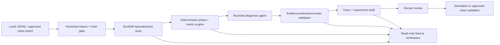

# EmbodiedOps 交付可用性与业务深度设计

## 目标

把当前 EmbodiedOps 原型从“代码已经完成”推进到“面试官可复现、产品边界可信、后续可接真实机器人数据”的交付状态。第一阶段不引入云服务、付费 API、真实机器人控制或未授权数据。

## 范围与顺序

### 阶段一：可访问、可复现、可验证

- Docker Compose 以明确的 `DEMO_READ_ONLY=true` 启动。
- API 启动时校验并幂等导入 `data/embodied/demo_episodes.jsonl` 与 manifest hash。
- 缺少 fixture、hash 不匹配、dataset version 冲突时 fail-closed，不生成空指标。
- 增加健康检查与 embodied 数据 smoke test；验证 `/healthz`、任务指标、episode、诊断只读行为。
- Quick Tunnel 只暴露前端 3000；API、数据库和 Ollama 不暴露。
- README 提供从冷启动到浏览 `/embodied` 的单条命令路径，并明确临时隧道无 SLA。

### 阶段二：真实数据接入与业务评测契约

- 新增 `real_robot_data=false/true` 数据卡字段与导入边界；真实数据只能通过本地文件或已批准的内部导出进入。
- 保持 episode schema 版本化，允许记录 robot model、firmware、task、scene、seed、传感器字段、失败类型和人工根因标签。
- 新增人工标注契约：根因、失败阶段、支持/反例事件、置信度、标注者与复核状态。
- 新增评测分层：raw model、validated system、business outcome。
- 业务指标固定为：成功率、碰撞率、超时率、诊断准确率、未知引用率、人工采纳率、平均诊断时延、实验后成功率 uplift。
- 合成 fixture 只能作为回归测试；真实数据评测必须单独标注数据来源、样本量、hold-out 划分和人工复核状态。

### 阶段三：面试展示层

- 新增 episode 轨迹/事件回放，不直接渲染或发送控制指令。
- 展示“失败现象 → 阶段证据 → 诊断候选 → 反例/未知 → 仿真实验 → 人审结果”的证据链。
- 增加实验前后 KPI 对比，明确样本量、控制条件、护栏指标和停止规则。
- 增加面试讲解页，区分产品需求、算法规则、AI Agent 边界、数据限制和上线验收标准。

## 架构与数据流

## 安全与错误处理

- 演示模式下所有写入 API 返回稳定 `DEMO_READ_ONLY`，fixture bootstrap 是受 hash 保护的初始化动作。
- 远程 source URL、真实机器人数据标记伪造、dataset version 冲突直接拒绝。
- 诊断遇到未知事件、越界窗口、缺反例、数字伪造或 provider 错误时 fail-closed。
- 页面不能把缺数据显示成 0%；空分母显示为 null/“不足以判断”。
- 不记录 prompt、原始模型响应、API key 或传感器原文到公开报告。

## 验收

- 冷启动后 `/healthz` 为 200，`/api/v1/embodied/tasks?dataset_version_id=embodied-demo-v1` 为 200 且 episode_count=30。
- `/embodied` 能显示指标、阶段、事件、诊断和离线评测边界。
- 只读演示下生成/导入/实验写入均返回 403。
- 后端专项、前端全量、Ruff、Next production build、PowerShell parser 均通过。
- 文档明确 synthetic fixture 不代表真实机器人或实时模型质量。

## 明确不做

- 不上传或采集 Unitree、优必选、傅利叶等公司的内部数据。
- 不新增云模型、付费 API、公网数据库或真实机器人控制接口。
- 不把合成数据的诊断准确率包装成生产 ROI；ROI 只能在真实任务 hold-out 与人工复核后报告。
